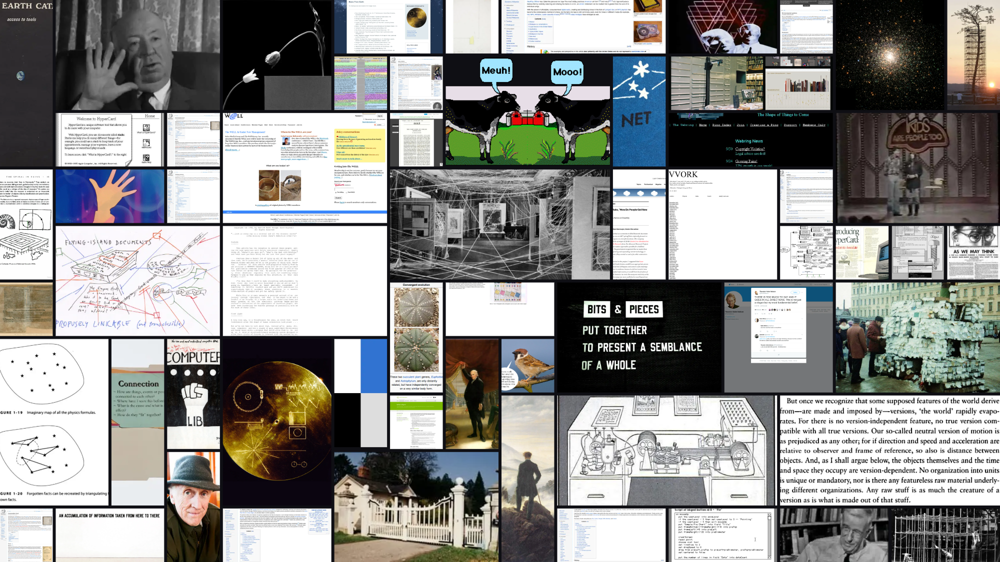

# Zenwall

**Turn any folder of photos, or an [are.na](https://www.are.na) channel, into a tiled mosaic wallpaper that's easy on OLED.**

Point it at your photo dump and get back a dense, gap-spaced collage sized for
your screen. Runs entirely in your browser: nothing is uploaded, nothing is stored.

→ **[Open the web app](https://www.matthewnoh.com/wallpaper/)** · [Case study on matthewnoh.com](https://www.matthewnoh.com/work/zenwall/)



## Why it exists

Three problems, one tool:

- **OLED burn-in.** A wallpaper that never changes slowly ghosts itself into the
  panel. Zenwall keeps the canvas near-black, reshuffles the whole mosaic on
  every re-roll, and can export a *rotation pack* so your desktop is never static.
- **The chunk logic.** Each image picks a tile size weighted by its orientation
  (portrait / landscape / square), then takes the grid slot next to the most
  already-placed neighbours, so the mosaic grows in tight clusters instead of
  scattering. It's the part that makes the output look composed rather than random.
- **A nice wallpaper source for designers.** are.na is where a lot of designers
  already keep their reference. Paste a channel and your moodboard becomes your
  desktop.

## Two ways to use it

### 1. The web app (no install)

Open the app, choose a source, export a PNG.

- **Your photos:** drag a folder in. Everything stays local (it's just
  `URL.createObjectURL`, never a network request).
- **are.na:** paste a public channel URL or slug. Fetched client-side via the
  are.na API.

Controls: tile density, gap, resolution presets (including ultrawide / 5120×1440),
near-black vs true-black canvas, re-roll, single-PNG export, and the rotation
pack (writes N shuffled variants to a folder you pick).

It's a static site. Host it anywhere, or just open `index.html`.

### 2. The Windows installer (auto-rotation)

For a desktop that rotates on its own, see [`installer/`](installer/): plain
PowerShell that downloads an are.na channel, renders mosaics from any folder,
sets the live wallpaper, and (optionally) regenerates hourly via Task Scheduler.

## How the engine works

[`engine.js`](engine.js) is a faithful canvas-2D port of the C# engine in the
installer. Same algorithm in both places:

1. Build a grid (`cols` × derived `rows`, cells roughly square).
2. Shuffle the image pool with a seeded RNG, so a layout is reproducible: same
   seed, same arrangement. That's what re-roll and the rotation pack ride on.
3. For each image: pick a chunk size from its orientation profile, find the
   highest-scoring free slot (most occupied neighbours, biased top-left), fall
   back to smaller chunks if it won't fit, then draw it `object-fit: cover`,
   clipped to the slot.

## Project layout

```
index.html      engine.js      arena.js      app.js      styles.css
installer/      Windows PowerShell auto-rotation (shared C# engine)
```

## Privacy

No backend, no analytics, no uploads. Local photos never leave the page. The
only network calls are to `api.are.na` and `images.are.na`, and only when you
ask for a channel.

## License

MIT © Matthew Noh
